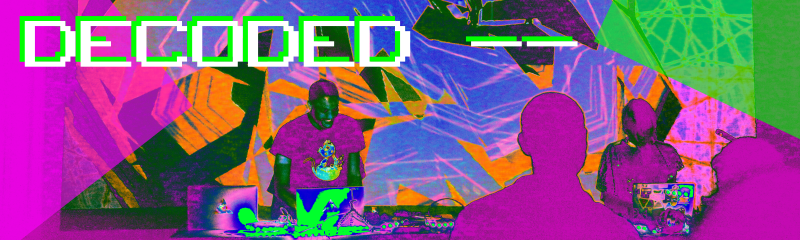

# DECODED Lite

A short, introductory workshop to livecoding in [Estuary](https://decoded.livecode.au/#/estuary/)

 - [Introduction to Livecoded Audio with Minitidal](/lite/audio-minitidal.md)
 - [Introduction to Livecoded Visuals with Punctual](/lite/visual-punctual.md)

If you would like to continue learning more about livecoding with Minitidal, Punctual and Estuary, check out:

 - [DECODED](https://decoded.livecode.au) for a detailed course
 - [Tidal Docs](https://tidalcycles.org/docs/) for more Tidalcycles/Minitidal information
 - [Punctual on Github](https://github.com/dktr0/Punctual) for more Punctual information
 - [My Github](https://github.com/cleary/livecode/) for lots of my example code
 - [Twitch](https://www.twitch.tv/clearyss/videos?filter=highlights&sort=time) for WeekEndJam highlights
 - For any questions, I am most easily contactable on the Estuary Discord server
